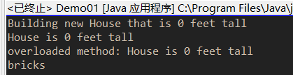
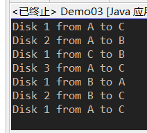

#task0004
##任务目的
* Method
##完成情况
###截图
*每张图为一个demo的截图
*demo1 
 
*demo3 
 
*demo6 
 
*demo11 
 
>*demo12 
 
>*demo15 
 
>###注1：
>*网上examples的源代码因为encoding所以有问题，已改正（参见代码注释）
>###注2：
>部分重点问题已通过注释在代码中显示
>##总结：
>本次练习了for-each结构，学习了可变长参数和枚举的使用。附参考资料 
>*可变长参数详解:
><[http://www.cnblogs.com/lanxuezaipiao/p/3190673.html](http://www.cnblogs.com/lanxuezaipiao/p/3190673.html)>